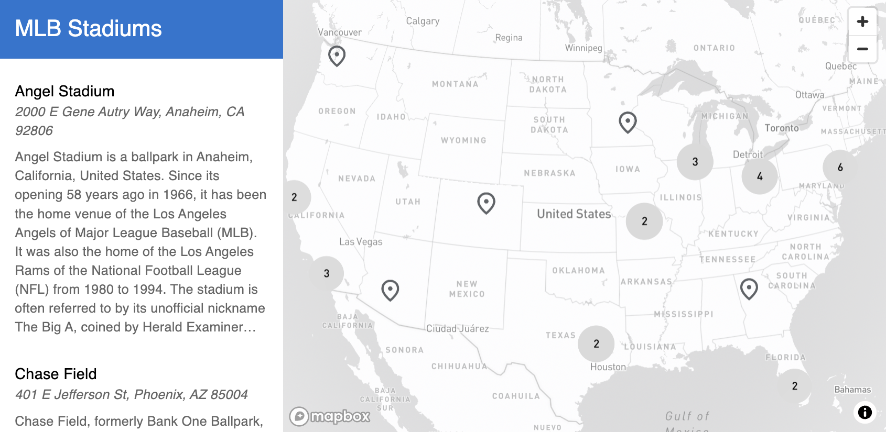

# material-ui-location-pin-map

A basic React map with a Siderbar of locations using Material UI Components.

## Installation

```bash
npm install material-ui-location-pin-map
```

## Usage

```jsx
import { LocationPinMap } from 'material-ui-location-pin-map';

<LocationPinMap
    data={{
    features: [
      {
        geometry: {
          coordinates: [
            -117.88174262759796,
            33.8002599
          ],
          type: 'Point'
        },
        properties: {
          Title: 'Angel Stadium',
          Subtitle: '2000 E Gene Autry Way, Anaheim, CA 92806',
          Description:'Home venue of the Los Angeles Angels',
        },
        type: 'Feature'
      }
    ]}}
    title={"MLB Stadiums"}
    accessToken={process.env.REACT_APP_MAPBOX_ACCESS_TOKEN}
/>
```

## Screenshots


